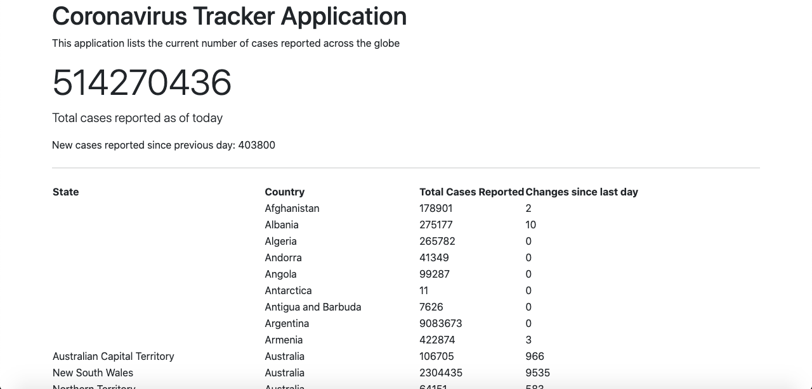
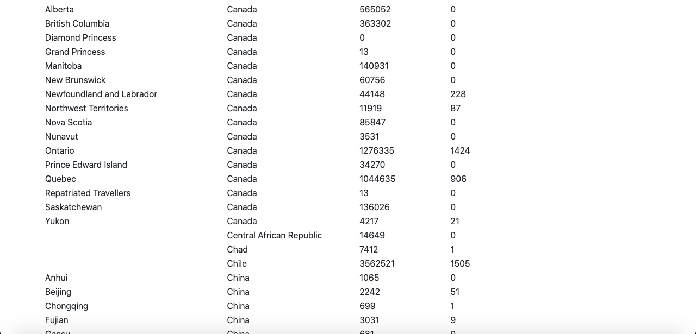
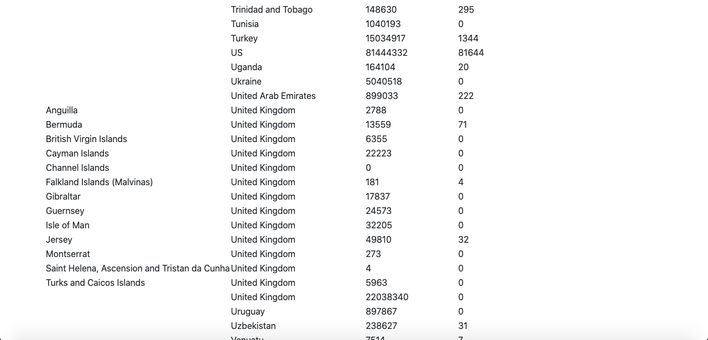

# coronavirus-tracker
 Spring Boot Java app to track coronavirus confirmed cases across the globe 
 
 I wanted to build an application which tracks the total number of cases of corona virus thats being reported around the world.
 
 theres a break down based on states and country shows the total number of cases since the begining also shows the recents changes in covid cases. Automatic update is done after every six hours

SCREENSHOT 1:

 

 
 
 SCREENSHOT 2:
 
 

 
 
 SCREENSHOT 3:
 
 

 
 
